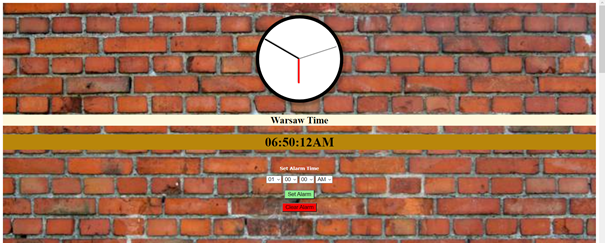
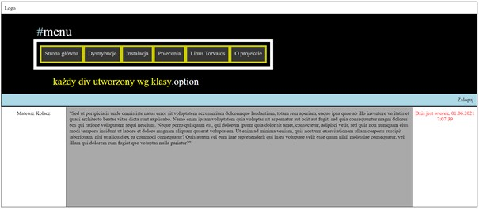
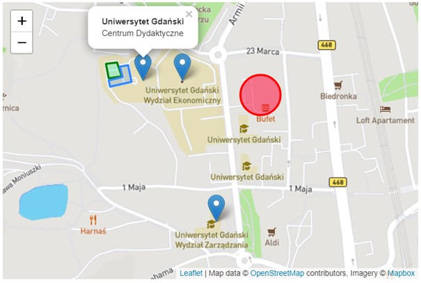

# HTML5-CSS-JS
This is an initial self-learn project containing solutions of tasks, which completion was neccessary to receive a positive grade from subject "Języki skryptowe - HTML5 i JavaScript" in my first year of studies at University of Gdańsk .

Each one of folders contains an individual and separate topic with assignment to complete independently by students.
Furthermore the content of each task is written in polish language and placed in a .docx file named "Summary". 

~ Mateusz Kołacz

## Table of contents
* [General info](#general-info)
* [Screenshots](#screenshots)
* [Technologies](#technologies)
* [Setup](#setup)
* [Status](#status)
* [Inspiration](#inspiration)
* [Contact](#contact)

## General info
The main purpose of this repository is to improve my HTML5, CSS3 and JavaScript skills.

## Screenshots

## Technologies
* HTML5
* CSS3
* JavaScript
* Leaflet
* AJAX

## Setup
In order to view results in your browser you need to:
1. Clone this repository to your hard drive or Desktop.
2. Open Assignment #/index.html or any .html file of your interest using Ms Edge/Firefox/Google Chrome/Opera and etc.
3. Enjoy yourself and feel free to explore the contents 

## Status
Project is: _in progress_

## Inspiration
Project based on materials made available to students by course teacher: Sławomir Radomski.

## Contact
Created by [@Matimateokol](https://github.com/Matimateokol) - feel free to contact me!
